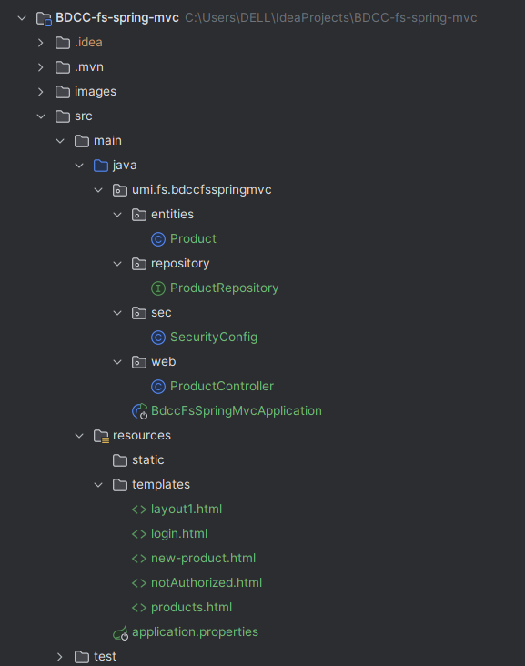

<<<<<<< HEAD
# BDCC-fs-spring-mvc
=======
# BDCC-fs-spring-mvc

## Description

Application web de gestion de produits développée avec Spring MVC.  
Elle intègre une sécurité via Spring Security pour gérer l'authentification et l'autorisation des utilisateurs avec deux rôles : **ADMIN** et **USER**.

---

## Fonctionnalités principales

- Gestion des produits (CRUD) accessible uniquement aux utilisateurs avec le rôle **ADMIN**.
- Consultation et recherche des produits pour les utilisateurs avec le rôle **USER**.
- Authentification sécurisée avec formulaires de login personnalisés.
- Pages d’erreur personnalisées pour accès non autorisé.
- Interface utilisateur construite avec Thymeleaf et Bootstrap.

---

## Technologies utilisées

- Java 21
- Spring Boot Initializr
- Thymeleaf (templates HTML)
- Spring Data JPA avec Hibernate
- Base de données H2 en mémoire
- Validation JSR
- Bootstrap 5 via WebJars

---

## Introduction

Ce projet vise à créer une application web Java EE contemporaine en exploitant les frameworks Spring Boot, Spring Data JPA, Hibernate, Thymeleaf et Spring Security.

Il s'agit d'une solution complète pour la gestion des produits, offrant des fonctionnalités telles que l'affichage, l'ajout, la suppression, la modification et la recherche de produits dans une base de données relationnelle. L'application est conçue selon une architecture en couches claire et utilise Bootstrap afin d'assurer une interface utilisateur réactive et conviviale.

---

## Architecture MVC du projet

Le projet suit l’architecture classique MVC (Model - View - Controller) propre aux applications Spring Boot. Il est organisé en plusieurs couches distinctes afin de garantir une meilleure maintenabilité et facilité d’évolution.

- **Entities** : contient les classes métier modélisées sous forme d’entités JPA.
- **sec** : responsable de la gestion de l’authentification et des autorisations grâce à Spring Security.
- **repository** : regroupe les interfaces qui assurent l’interaction avec la base de données via Spring Data JPA.
- **Web (Controllers + Vues)** :
    - **Contrôleurs (Controllers)** : traitent les requêtes HTTP, invoquent les services métier et renvoient les vues appropriées.
    - **Vues (Thymeleaf)** : pages HTML générées avec le moteur de templates Thymeleaf, incluant l’utilisation de Thymeleaf Layout Dialect pour gérer un template principal (`layout.html`).

---

## Illustration de la structure

>>>>>>> 2f2bb9c (Initial commit - ajout du projet BDCC-fs-spring-mvc)
