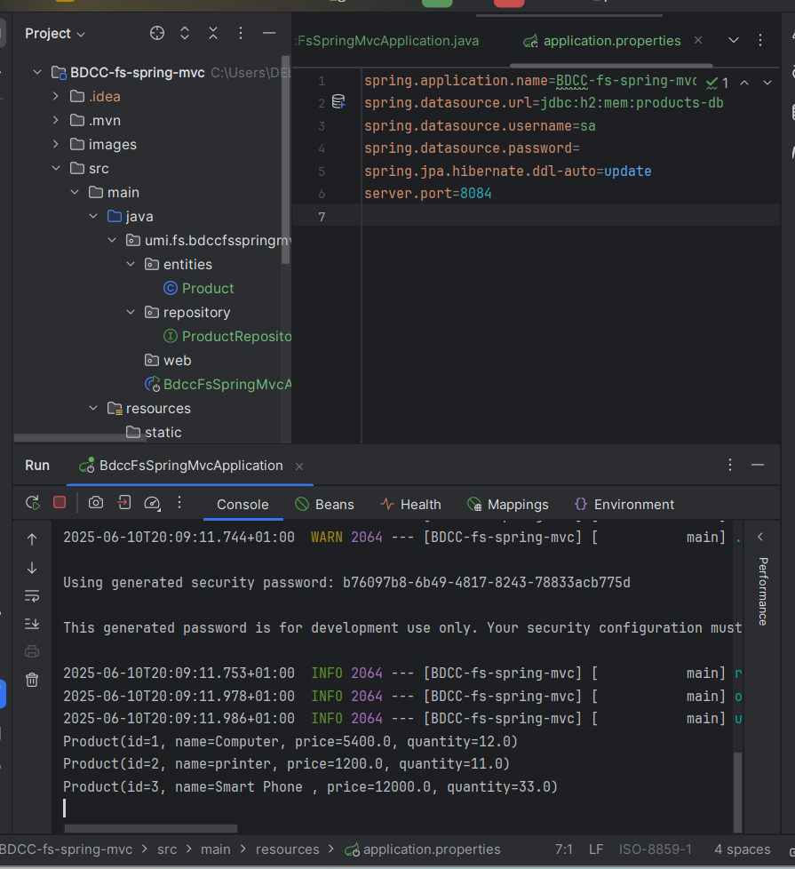
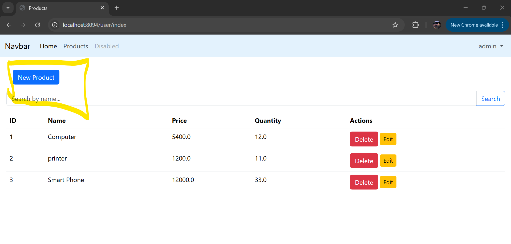
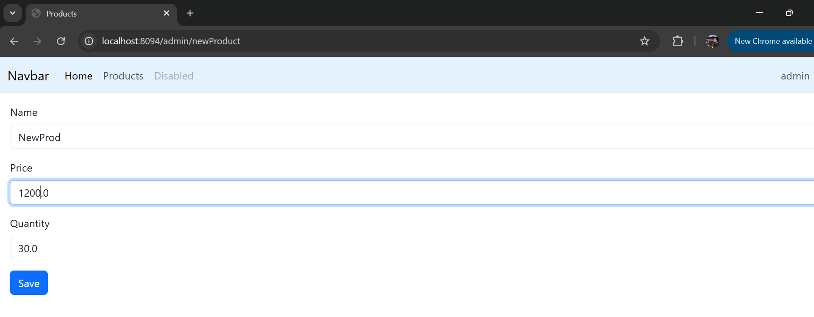
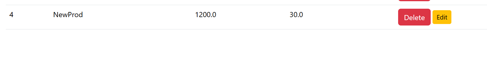
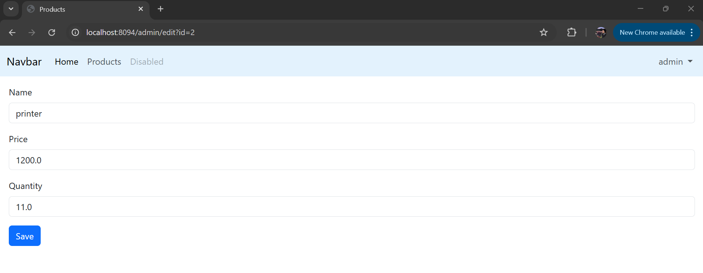
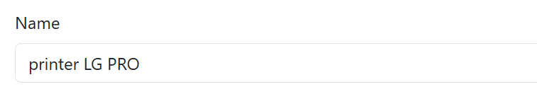
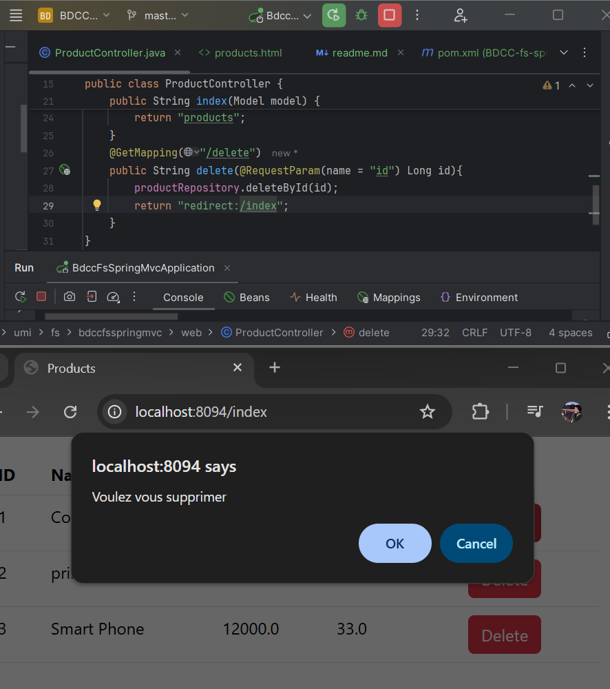
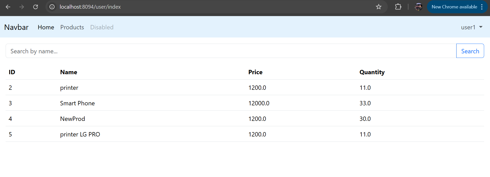
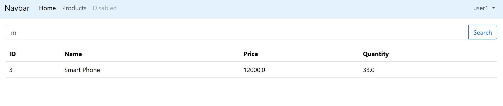

# BDCC-fs-spring-mvc

## Description

Application web de gestion de produits développée avec **Spring MVC**.  
Elle intègre une sécurité via **Spring Security** pour gérer l'authentification et l'autorisation des utilisateurs avec deux rôles : **ADMIN** et **USER**.

---

## Fonctionnalités principales

- Gestion des produits (CRUD) accessible uniquement aux utilisateurs avec le rôle **ADMIN**.
- Consultation et recherche des produits pour les utilisateurs avec le rôle **USER**.
- Authentification sécurisée avec formulaires de login personnalisés.
- Pages d’erreur personnalisées pour accès non autorisé.
- Interface utilisateur construite avec **Thymeleaf** et **Bootstrap**.

---

## Technologies utilisées

- Java 21
- Spring Boot Initializr
- Thymeleaf (templates HTML)
- Spring Data JPA avec Hibernate
- Base de données H2 en mémoire
- Validation JSR
- Bootstrap 5 via WebJars

---

## Introduction

Ce projet vise à créer une application web Java EE moderne en exploitant les frameworks **Spring Boot**, **Spring Data JPA**, **Hibernate**, **Thymeleaf** et **Spring Security**.

Il s'agit d'une solution complète pour la gestion des produits, offrant les fonctionnalités suivantes : affichage, ajout, suppression, modification et recherche de produits dans une base de données relationnelle. L'application adopte une architecture en couches claire et utilise Bootstrap pour garantir une interface utilisateur réactive et conviviale.

---

## Architecture MVC du projet

Le projet suit l’architecture classique **MVC (Model - View - Controller)** propre aux applications Spring Boot. Il est organisé en plusieurs couches distinctes pour une meilleure maintenabilité :

- **Entities** : contient les classes métier (entités JPA).
- **sec** : gère l’authentification et l’autorisation avec Spring Security.
- **repository** : interfaces JPA pour interagir avec la base de données.
- **web** :
  - **Controllers** : traitent les requêtes HTTP, invoquent la logique métier et retournent les vues.
  - **Views** : pages HTML avec **Thymeleaf**, intégrant le layout principal (`layout.html`) via **Thymeleaf Layout Dialect**.

---

## Illustration de la structure

- Structure du projet :  
  

- Test de l'application :  
  

---

## Interface Admin

L'administrateur dispose des droits complets pour gérer les produits : **ajouter**, **modifier** et **supprimer**.

### Fonctionnalités

- Création d’un nouveau produit
- Suppression d’un produit existant
- Modification et sauvegarde d’un produit

### Exemple de code

```java
@GetMapping("/admin/newProduct")
@PreAuthorize("hasRole('ADMIN')")
public String newProduct(Model model) {
    model.addAttribute("product", new Product());
    return "new-product";
}

@GetMapping("/")
public String home(Model model) {
    return "redirect:/user/index";
}

@PostMapping("/admin/delete")
@PreAuthorize("hasRole('ADMIN')")
public String delete(@RequestParam(name = "id") Long id){
    productRepository.deleteById(id);
    return "redirect:/user/index";
}

@PostMapping("/admin/saveProduct")
@PreAuthorize("hasRole('ADMIN')")
public String saveProduct(@Valid Product product, BindingResult bindingResult, Model model) {
    if(bindingResult.hasErrors()) {
        return "new-product";
    }
    productRepository.save(product);
    return "redirect:/admin/newProduct";
}
```


### Description des Méthodes

Ce document décrit les différentes méthodes disponibles dans le contrôleur de gestion des produits.

- newProduct

Affiche le formulaire permettant de créer un **nouveau produit**.

- home

Redirige vers la **page d'accueil utilisateur**.

- delete

Supprime un produit à partir de son **identifiant (ID)**.

- saveProduct

Sauvegarde un produit après **validation du formulaire**.


# 📘 Application de Gestion des Produits

## ✨ Description des Méthodes

- **`newProduct`** : Affiche le formulaire permettant de créer un **nouveau produit**.
- **`home`** : Redirige vers la **page d'accueil utilisateur**.
- **`delete`** : Supprime un produit à partir de son **identifiant (ID)**.
- **`saveProduct`** : Sauvegarde un produit après **validation du formulaire**.

---

##  Illustration

### Ajouter un produit

  
  


---

###  Modifier un produit

  
  


---

### Supprimer un produit

  


---

##  Interface Admin & Sécurité

L'application utilise **Spring Security** pour la gestion des rôles :

- Un utilisateur avec le rôle `USER` peut consulter et rechercher des produits.
- Seul un `ADMIN` peut ajouter, modifier ou supprimer des produits.

###  Interface utilisateur (USER)

- **Consulter les produits**  
  

- **Rechercher des produits**  
  

---

## Conclusion


Cette application de gestion des produits offre une interface simple et sécurisée pour permettre aux utilisateurs de consulter et rechercher les produits, tandis que les administrateurs disposent des droits complets pour ajouter, modifier et supprimer des produits.

Grâce à l'intégration de Spring Security, les rôles et permissions sont bien gérés pour garantir la sécurité et la confidentialité des opérations.

Ce projet a été développé avec soin pour répondre aux besoins d'une gestion efficace des produits dans un environnement web moderne.


Projet réalisé par **Aamer Fadma**.

---
